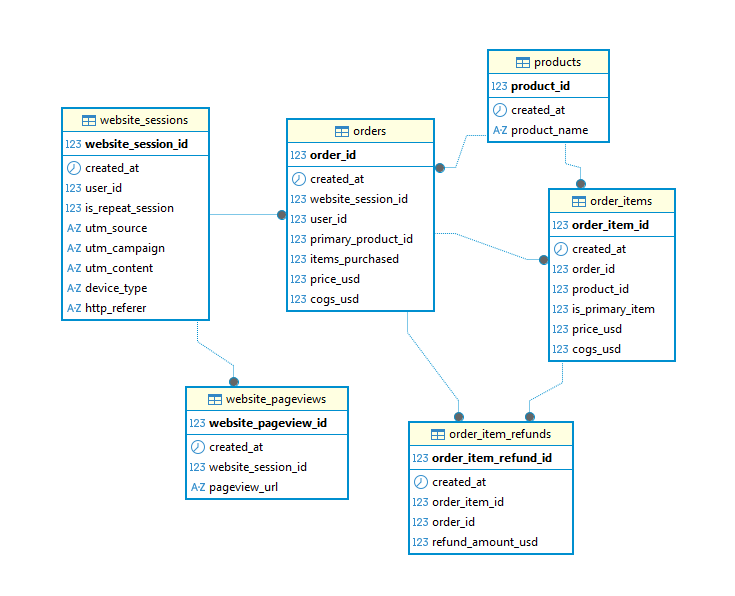
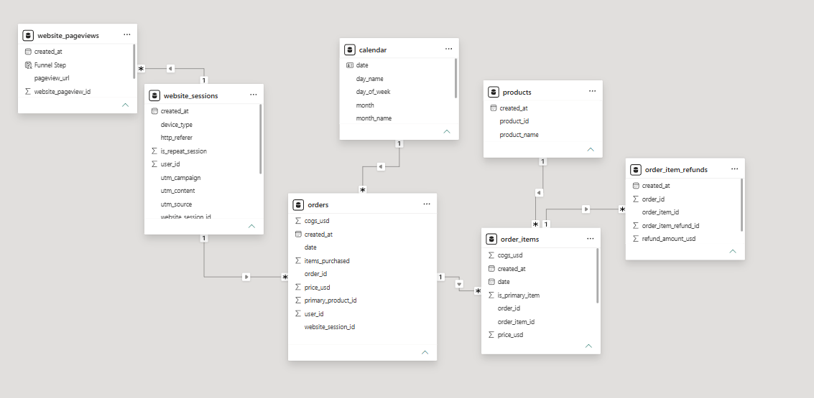

# Maven Fuzzy Factory — E-Commerce Marketing Performance Analysis

An end-to-end SQL + Power BI analysis of a fictional e-commerce retailer's sales, marketing, and website behavior data, covering March 2012 – March 2015.

## Overview

This project analyzes revenue, profitability, product performance, marketing channel effectiveness, and the customer purchase funnel using PostgreSQL for data modeling and analysis, and Power BI for interactive dashboarding.

**Full write-up with narrative and key findings:** [Notion Page](https://app.notion.com/p/Maven-Fuzzy-Factory-E-Commerce-Marketing-Performance-Analysis-39af8f28dbd280198c8ed81cbb1a9ec1?source=copy_link)

## Dataset

- **Source:** [Maven Analytics Data Playground](https://mavenanalytics.io/data-playground) — Maven Fuzzy Factory
- **Scope:** 6 relational tables covering orders, order items, refunds, products, website sessions, and pageviews
- **Date range:** March 19, 2012 – March 19, 2015 (final month partial; excluded from year-over-year analysis)

| Table | Description |
|---|---|
| `orders` | One record per completed customer order |
| `order_items` | One record per item within an order |
| `order_item_refunds` | One record per refunded item |
| `products` | One record per product |
| `website_sessions` | One record per website session (traffic source, campaign, device) |
| `website_pageviews` | One record per pageview within a session |

## Entity Relationship Diagram



## Business Questions

- How has revenue and profit changed over time?
- Which products contribute the most to revenue and profit?
- How significant are refunds across different products?
- Which marketing channels generate the strongest business performance?
- Where do customers drop off throughout the purchase funnel?
- How effectively does the website convert visitors into customers?
- What are the key business KPIs driving overall performance?

## Tech Stack

- **PostgreSQL** (via DBeaver) — schema design, data cleaning, SQL analysis
- **Power BI** — data modeling, DAX measures, dashboard

## Repository Structure

```
├── sql/
│   ├── schema.sql               # Table creation + FK constraints
│   ├── analysis.sql             # Full analytical queries + validation checks
│   └── eda.sql                  # Exploratory queries + data quality discovery
├── dashboard/
│   └── PBIX_LINK.md             # Link to the .pbix file (hosted externally, see below)
├── assets/
│   ├── erd.png
│   └── power_bi_data_model.png
├── docs/
│   └── dax_measures.md          # Full DAX measure reference (8 measures)
└── README.md
```

## Approach

1. **Data preparation** — reviewed raw CSVs (Excel for smaller tables, Power Query for larger ones) to understand structure, identify data quality issues, and inform schema design before writing any SQL. Full exploratory queries — schema investigation, distinct value checks, and the discovery of the literal-string `"NULL"` issue — are in [`sql/eda.sql`](sql/eda.sql).
2. **Schema design** — built a normalized relational schema in PostgreSQL with appropriate data types, `NOT NULL` constraints based on actual data patterns (not assumptions), and 7 foreign key relationships
3. **Data quality handling** — identified and corrected literal `"NULL"` strings (as opposed to true SQL NULLs) in `website_sessions` UTM columns, which represent legitimate direct/organic traffic rather than missing data
4. **SQL analysis** — wrote analytical queries using CTEs, window functions (`LAG`), and conditional aggregation to answer each business question, including a multi-stage sequential funnel built from chained CTEs
5. **Power BI modeling** — imported cleaned tables (not pre-aggregated SQL outputs) to preserve full analytical flexibility in Power BI; built DAX measures for conversion rate, cart abandonment rate, and funnel stage classification
6. **Dashboard build** — two-page interactive report (Overview: sales/product performance; Marketing: channel performance and funnel)

## Data Model


The model isn't a traditional single-fact-table star schema — it's closer to the source relational structure, reflecting two related but distinct grains of activity: **session/behavioral data** (`website_pageviews` → `website_sessions`) and **transactional data** (`orders` → `order_items` → `order_item_refunds`), linked through `website_session_id`. Rather than force these into one artificial fact table, they're kept as linked tables at their natural grain, with a dedicated `calendar` table added for time-based filtering.

## Key SQL Techniques Demonstrated

- CTEs and window functions (`LAG`, sequential CTE chaining for funnel logic)
- Conditional aggregation (`CASE WHEN` inside `COUNT`/`SUM`)
- `COALESCE` for handling nulls in categorical fields
- Correct use of `DISTINCT`/`COUNT(DISTINCT ...)` to avoid fan-out in one-to-many joins
- Data quality investigation (literal-string nulls vs. true nulls)

## Key DAX Measures

- **Conversion Rate %** — session-to-purchase rate
- **Cart Abandonment Rate %** — sessions reaching cart that didn't complete purchase
- **Funnel Step** — classifies each pageview into its funnel stage via `SWITCH`
- **Average Order Value** — revenue per completed order

Full reference for all 8 measures (including Total Revenue, Total Profit, Revenue per Session, and Refund Rate %) is in [`docs/dax_measures.md`](docs/dax_measures.md).

## Dashboard

**Page 1 — Overview:** Revenue/profit trend, AOV trend, revenue and refund rate by product, conversion rate by device. Filters: Year, Product.

**Page 2 — Marketing:** Conversion rate trend, profit by campaign, revenue by content, conversion rate by traffic source, purchase funnel. Filters: Year, Campaign, Traffic Source.

## Power BI File

The full `.pbix` file (data model, relationships, and all DAX measures) is hosted externally due to file size — see [`dashboard/PBIX_LINK.md`](dashboard/PBIX_LINK.md) for the download link. All data was imported (not live-connected), so the file is self-contained and opens without needing the original database.

## Limitations

- No `users` table exists in the source data, so customer-level metrics (lifetime value, retention rate) could not be calculated — analysis is session-based, not customer-based
- The funnel measures *page reach*, not confirmed purchase intent — a session reaching `/cart` may reflect browsing or reconsideration rather than genuine intent to buy
- March 2015 is excluded from all year-over-year comparisons due to being a partial month (data ends March 19, 2015)

## Key Findings

See the [full write-up](https://app.notion.com/p/Maven-Fuzzy-Factory-E-Commerce-Marketing-Performance-Analysis-39af8f28dbd280198c8ed81cbb1a9ec1?source=copy_link) for detailed insights and recommendations. Headline findings:
- Revenue grew primarily through both traffic growth and rising AOV across 2012–2014
- The Product Details → Cart funnel stage has the steepest drop-off (55.1%) of any stage
- Direct and branded search traffic convert better than nonbrand campaigns, despite nonbrand driving more total profit

## Author

Renaldi Ananda Riadi — [LinkedIn](https://www.linkedin.com/in/renaldiananda/) — [Portfolio](https://renaldi-portfolio.super.site/)
